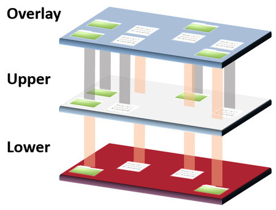

While my friend [Victor] and I were writing [Kindelia], he implemented a
solution to maintain a set of snapshots of the network's memory and challenged
us to find an algorithm with the same properties, as — I believe — an attempt to
validate his solution as he had never found a similar solution being described,
much less named.

## The problem

- A computationally-heavy transaction is applied to the current state to get the
  next state ( $ S_{t+1} = f(S_t, x_t) ) $ at each time interval.
- We want to be able to roll back to previous states using the least amount of
  computation (applications of $f$).
- We can't keep copies of the entire state, as it is too big, so we must layer
  the states' snapshots in a memory-efficient way.
- As accessing the stored data need to be fast, we need to keep a small amount
  snapshots, so we don't need to iterate through a lot of them for a simple
  access.

<figure class="image">
  
  <figcaption>
    Example of an overlay file system.Similar to our layered data storage
    solution.[^1]
  </figcaption>
</figure>

||
| :--- |
| An overlay file system, similar to our layered data storage solution.[^1] |

## The Algorithm's properties

- Only $ O(t) $ snapshots are kept.
- The number of re-computations of $ f $ necessary to roll back to a
  previous state is linear ($ O(\Delta t) $), where $ \Delta t $ is the number
  of ticks/transactions between the current state and the desired state.
- ...

## The solution

...

## Implementation

...

### Haskell example

```hs
...
```

### Rust library

WIP [github.com/steinerkelvin/fewsnap-rs](https://github.com/steinerkelvin/fewsnap-rs)

[^1]: from [here](https://embeddedcomputing.com/technology/processing/understand-what-an-overlayfs-is-and-how-it-works)

[Victor]: https://twitter.com/VictorTaelin
[Kindelia]: https://github.com/HigherOrderCO/Kindelia
